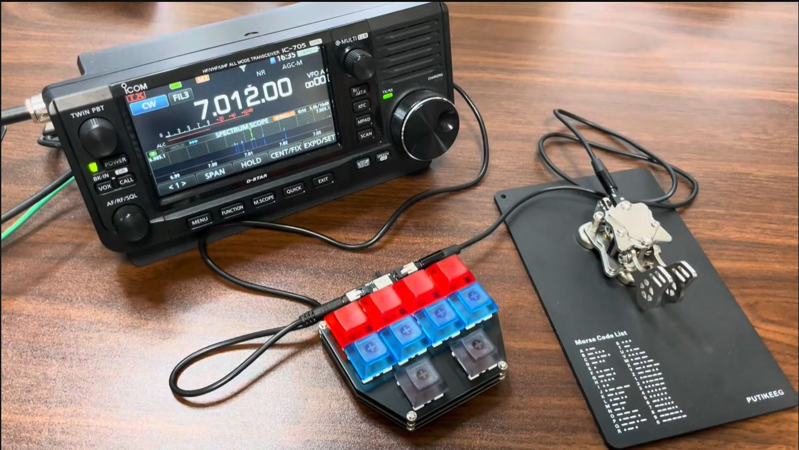
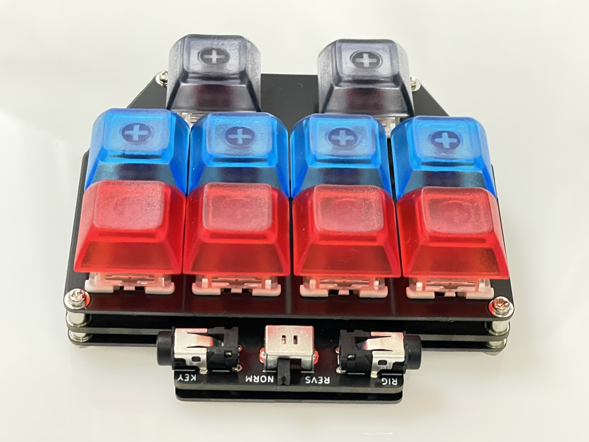
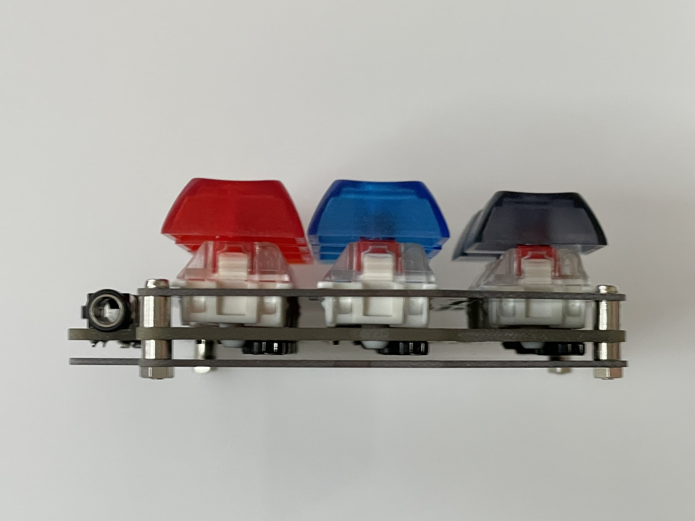
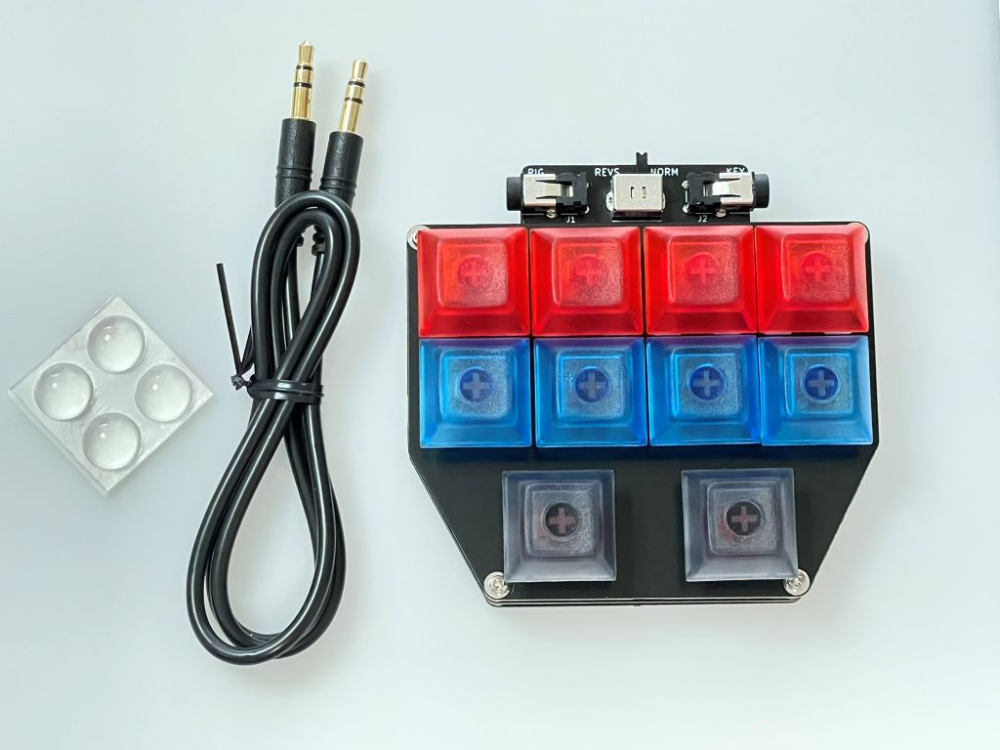
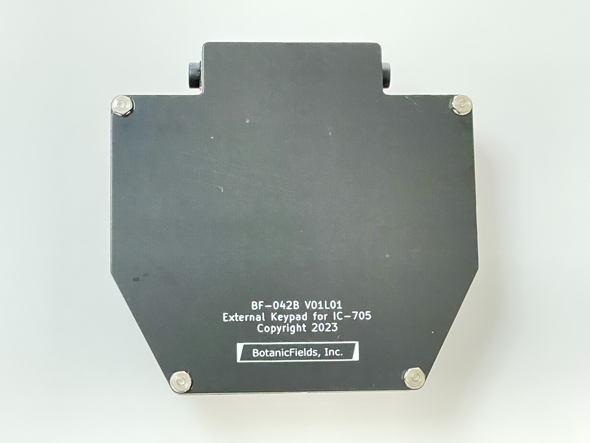

# Keypad for IC705
External Keypad for ICOM IC-705

# ICOM IC-705用外部キーパッド  

ICOM社製アマチュア無線用トランシーバーIC-705に接続して使用する外部キーパッド"External Keypad for IC-705"を製作しました。IC-705の取扱説明書「19.コネクター情報 ■KEYジャック」において、回路図とともに「お客様でご用意ください」と説明されている「外部キーパッド」に基づいています。

- IC-705の取扱説明書   
[ICOM IC-705 サポート・ダウンロード](https://www.icom.co.jp/lineup/products/IC-705/?open=4#detail_content)  

- 動作の様子(YouTube)  
[External Keypad for ICOM IC-705](https://youtu.be/w8RicOxXwO8?si=ilTV2mg2VO1FOSIj)

## 特長
以下の「外部キーパッド」の機能を利用できます。

- KEYERメモリー(M1～M8)、SSB/AM/FM/DVのVOICE TXメモリー(T1～T8)、RTTYメモリー(RT1～RT8)の送出を制御できます。
- IC-705のLCDにKEYERメモリー、VOICE TXメモリー、RTTYメモリーのボタンを表示していなくてもメモリーを送出できます。

以下の追加機能があります。

- パドル等を接続するためのジャック(Φ3.5mm)があり、電鍵(ストレートキー)、パドル、または外部エレクトロニックキーヤーを並列接続できます。
- パドルに相当する2個のボタンを追加しています。パドルの代替として使えるかもしれません。
- パドルの左右を入れ替えるスライドスイッチがあります。パドル相当のボタンの左右も入れ替わります。
- ボタンスイッチには、作動力45-50g・リニア・静音タイプのキースイッチを使用しています。
- キースイッチはソケットで取付けてあり、お好みのタイプのCherry MX互換キースイッチに交換できます。
- キートップも、お好みで交換できます。

## 使い方

- IC-705のKEYジャックと"External Keypad for IC-705"の"RIG"ジャックを付属のミニステレオケーブルで接続します。
- パドル等は、"External Keypad for IC-705"の"KEY"ジャックに接続します。
- "External Keypad for IC-705"のスライドスイッチが"NORM(Normal)"の場合、パドルの左側が短点、右側が長点です。パドルの左右を逆にするには、"REVS(Reverse)"に設定します。
- IC-705本体で、外部キーパッドの設定をONにします。  
(MENU >> SET > 外部端子 > 外部キーパッド > VOICE / KEYER / RTTY)
- "External Keypad for IC-705"の上段・中段の8個のボタンは、KEYERメモリー(M1～M8)、SSB/AM/FM/DVのVOICE TXメモリー(T1～T8)、RTTYメモリー(RT1～RT8)に対応します。下段の2個のボタンはパドルの短点・長点に対応します。
- ボタン操作や、KEYERメモリー、VOICE TXメモリー、RTTYメモリーの設定方法については、IC-705の取扱説明書を参照してください。

## お願い

- 構造上、側面のカバーがありません。液体・塵埃などの侵入にご注意ください。
- キースイッチは、はめ込みで固定しています。かかる力によっては外れることがあります。外れた場合には慎重に取付けてください。
- 部品のメーカや品種を類似品に切り替える場合があります。キートップの色味、キースイッチの感触などが製造時期等により変わることが考えられます。

## 構成

- 天板(スイッチプレートまたはマウントプレート)、配線基板、底板から成るサンドイッチマウント構造です。
- 天板と底板は1mm厚の、配線基板は1.6mm厚のプリント基板(FR-4素材)で製造しています。
- 天板と配線基板感は4mm, 配線基板と底板間は2mmです。通し穴はM2用です。
- 配線基板上のキースイッチのフットプリントは、Cherry MX互換で3pin/5pin両対応です。
- ソケットを使用していますが、キースイッチを配線基板にはんだ付けすることも可能です。振動などの環境や経年等に対する信頼性のためには、はんだ付けが有利です。

### 図面(PDF)

- [回路図](pdf/BF-042_scheme.pdf)  
- [基板図 配線基板(1.6mm厚)部品面](pdf/BF-042_front.pdf)  
- [基板図 配線基板(1.6mm厚)はんだ面](pdf/BF-042_back.pdf)  
- [基板図 天板(1mm厚)](pdf/BF-042A_front.pdf)  
- [基板図 底板(1mm厚)](pdf/BF-042B_back.pdf)  
- [添付説明書](pdf/BF-042_doc.pdf)

### 製造データ(Gerber)  
KiCad 8.0.2でレイアウト設計し、プラグイン"Fabrication Toolkit"でJLCPCB向けに出力しています。

- [Gerber 配線基板(1.6mm厚)](gerber/BF-042_V01L02.zip)
- [Gerber 天板(1mm厚)](gerber/BF-042A_V01L02.zip)
- [Gerber 底板(1mm厚)](gerber/BF-042B_V01L02.zip)

## 付属品

- シリコンゴム  4個  
机等の傷防止のため"External Keypad for IC-705"の底面に貼り付けてください。  
[秋月電子通商「接着シール付き透明ゴムクッション」](https://akizukidenshi.com/catalog/g/g110080/)  

- ミニステレオケーブル  1本  
IC-705と"External Keypad for IC-705"の接続に使用ください。  
[秋月電子通商「3.5mmステレオミニプラグオーディオケーブル 金メッキ スリム 0.5m(50cm)」](https://akizukidenshi.com/catalog/g/g113082/)

以上